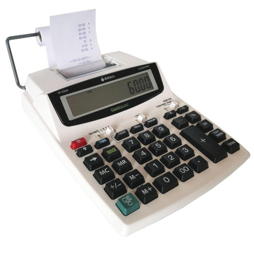

# An adding machine REPL

A simple, practical REPL example is `adder.py`, which can be used from the command line. It's a "adding machine" that does just that: it adds numbers — the most common use of traditional desktop adding machines with paper tape. The file `adder_test.py` is another example of using `Dialogue`.

Here is an `adder.py` session from start to finish:

```
$ ./adder.py 
Enter 0 to quit.
[1] 10
10.0
[2] 22.5
32.5
[3] 17.97
50.47
[4] zzz
Please type numbers.
[4] 33.05
83.52
[5] 0
$
```

> My father, Jairo Ramalho, liked to say that an adding machine with paper tape is much better than a handheld calculator or calculator app that only shows one number at a time. With the adding machine you can easily double check the numbers on the paper tape. Jairo would enjoy using `adder.py`.


